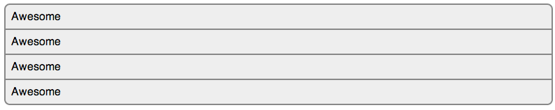
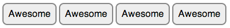
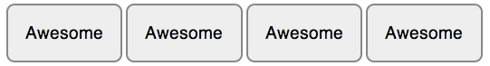
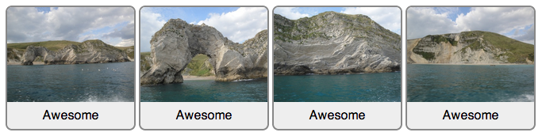

list.css
========

Different types of lists in one stylesheet

## Vertical list



```html
<ul class="list--vertical">
  <li>Awesome</li>
  <li>Awesome</li>
  <li>Awesome</li>
  <li>Awesome</li>
</ul>
```
## Horizontal list



```html
  <ul class="list--horizontal">
    <li>Awesome</li>
    <li>Awesome</li>
    <li>Awesome</li>
    <li>Awesome</li>
  </ul>
```
## Large horizontal list



```html
<ul class="list--horizontal list--large">
  <li>Awesome</li>
  <li>Awesome</li>
  <li>Awesome</li>
  <li>Awesome</li>
</ul>
```

## Image list



```html
<ul class="list--horizontal list--image">
  <li>Awesome</li>
  <li>Awesome</li>
  <li>Awesome</li>
  <li>Awesome</li>
</ul>
```
